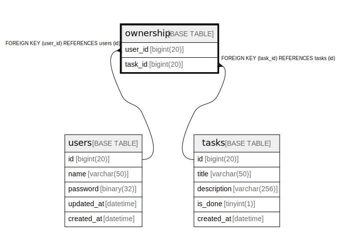

# ownership

## Description

<details>
<summary><strong>Table Definition</strong></summary>

```sql
CREATE TABLE `ownership` (
  `user_id` bigint(20) NOT NULL,
  `task_id` bigint(20) NOT NULL,
  PRIMARY KEY (`user_id`,`task_id`),
  KEY `task_id` (`task_id`),
  CONSTRAINT `ownership_ibfk_1` FOREIGN KEY (`user_id`) REFERENCES `users` (`id`) ON DELETE CASCADE,
  CONSTRAINT `ownership_ibfk_2` FOREIGN KEY (`task_id`) REFERENCES `tasks` (`id`) ON DELETE CASCADE
) ENGINE=InnoDB DEFAULT CHARSET=utf8mb4
```

</details>

## Columns

| Name | Type | Default | Nullable | Children | Parents | Comment |
| ---- | ---- | ------- | -------- | -------- | ------- | ------- |
| user_id | bigint(20) |  | false |  | [users](users.md) |  |
| task_id | bigint(20) |  | false |  | [tasks](tasks.md) |  |

## Constraints

| Name | Type | Definition |
| ---- | ---- | ---------- |
| ownership_ibfk_1 | FOREIGN KEY | FOREIGN KEY (user_id) REFERENCES users (id) |
| ownership_ibfk_2 | FOREIGN KEY | FOREIGN KEY (task_id) REFERENCES tasks (id) |
| PRIMARY | PRIMARY KEY | PRIMARY KEY (user_id, task_id) |

## Indexes

| Name | Definition |
| ---- | ---------- |
| task_id | KEY task_id (task_id) USING BTREE |
| PRIMARY | PRIMARY KEY (user_id, task_id) USING BTREE |

## Relations



---

> Generated by [tbls](https://github.com/k1LoW/tbls)
