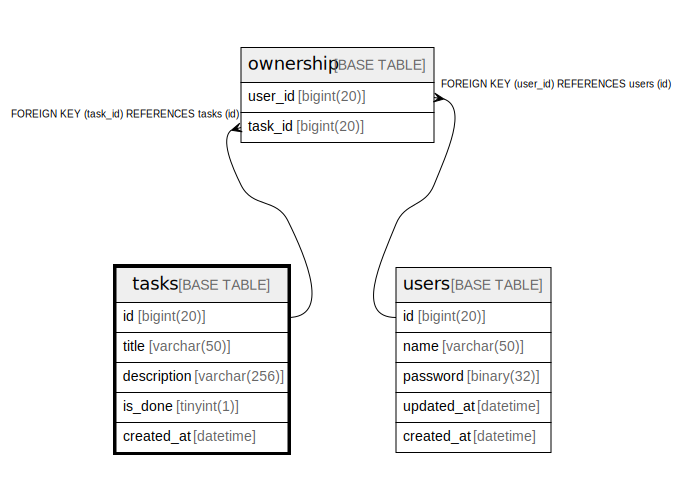

# tasks

## Description

<details>
<summary><strong>Table Definition</strong></summary>

```sql
CREATE TABLE `tasks` (
  `id` bigint(20) NOT NULL AUTO_INCREMENT,
  `title` varchar(50) NOT NULL,
  `description` varchar(256) NOT NULL DEFAULT '',
  `is_done` tinyint(1) NOT NULL DEFAULT '0',
  `created_at` datetime NOT NULL DEFAULT CURRENT_TIMESTAMP,
  PRIMARY KEY (`id`)
) ENGINE=InnoDB AUTO_INCREMENT=[Redacted by tbls] DEFAULT CHARSET=utf8mb4
```

</details>

## Columns

| Name | Type | Default | Nullable | Extra Definition | Children | Parents | Comment |
| ---- | ---- | ------- | -------- | ---------------- | -------- | ------- | ------- |
| id | bigint(20) |  | false | auto_increment | [ownership](ownership.md) |  |  |
| title | varchar(50) |  | false |  |  |  |  |
| description | varchar(256) |  | false |  |  |  |  |
| is_done | tinyint(1) | 0 | false |  |  |  |  |
| created_at | datetime | CURRENT_TIMESTAMP | false |  |  |  |  |

## Constraints

| Name | Type | Definition |
| ---- | ---- | ---------- |
| PRIMARY | PRIMARY KEY | PRIMARY KEY (id) |

## Indexes

| Name | Definition |
| ---- | ---------- |
| PRIMARY | PRIMARY KEY (id) USING BTREE |

## Relations



---

> Generated by [tbls](https://github.com/k1LoW/tbls)
